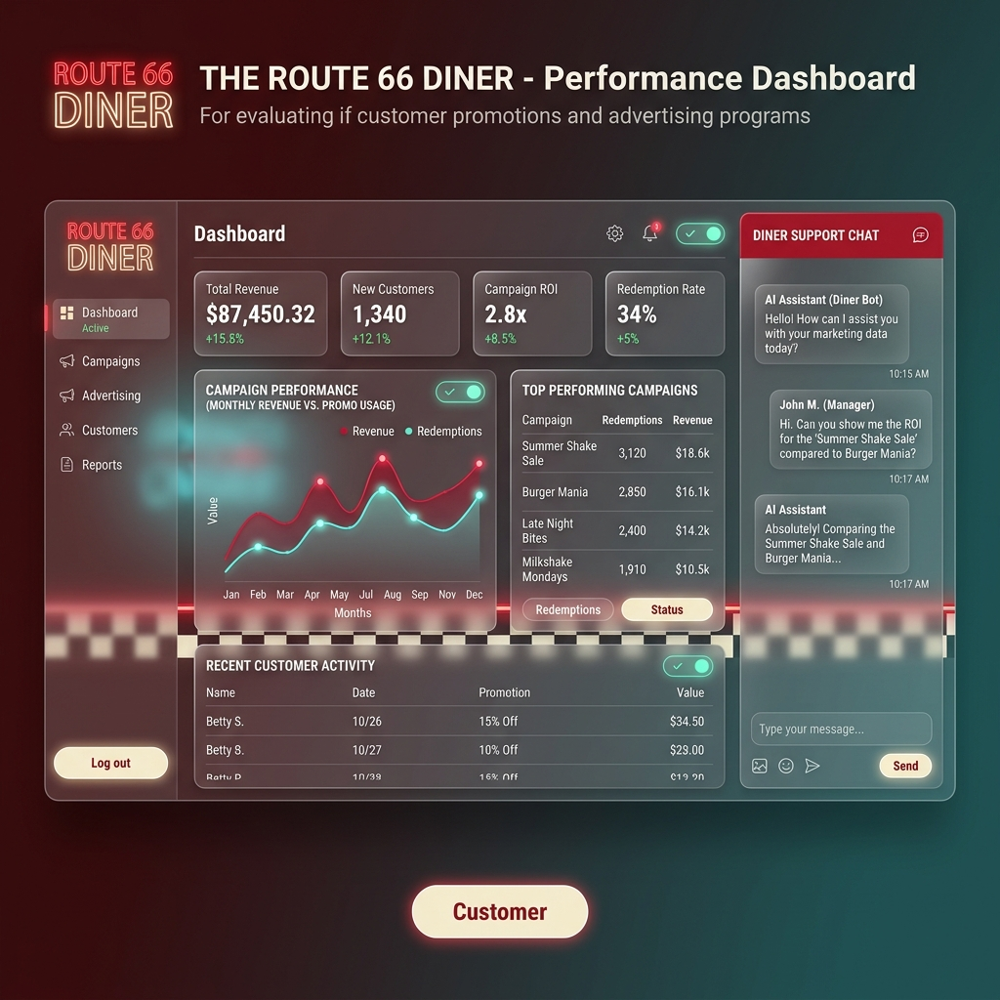

# Diner Dashboard Design Proposal

This proposal outlines the design and architecture for a classic American diner dashboard, integrated with CopilotKit to support marketing analysis and promotion evaluation.

## Visual Concept
The design follows a **"Retro-Neon Glassmorphism"** aesthetic. It combines the nostalgic vibe of a 1950s diner with a modern, premium dark mode interface.

- **Colors**: Cherry Red accents, Vanilla Cream surfaces, and Teal/Turquoise for data visualization.
- **Atmosphere**: Semi-transparent surfaces (glassmorphism), neon glow effects on active elements, and a subtle checkerboard pattern accent.

## Layout Structure
The interface is split into two main sections:
1.  **Dashboard Area (75% Width)**: A grid of dynamic components that update based on the marketing questions asked.
2.  **Copilot Chat (25% Width)**: Powered by `CopilotSidebar`, allowing the user to interact with the data via AI.

## Dynamic Components (Generative UI)
The dashboard components will change dynamically based on the chat context. Here are some proposed views:

### 1. Default / Overview View
- **Metric Cards**: Total Revenue, New Customers, Campaign ROI, Redemption Rate.
- **Campaign Performance**: A line/area chart showing revenue vs. promo usage over time.
- **Top Performing Campaigns**: A table listing the most successful promotions.
- **Recent Customer Activity**: A log of recent orders.

### 2. Customer Loyalty View (Triggered by questions about customers)
- **Customer Grid**: Cards for the top 50 customers with their loyalty tier and favorite items.
- **Retention Chart**: Cohort analysis or repeat visit frequency.

### 3. Menu & Promotion Impact (Triggered by questions about specific items)
- **Menu Popularity**: A chart showing which items are most often bought with promotions.
- **Promo Breakdown**: Detailed stats for a selected promotion.

## CopilotKit Integration

### Readables (`useCopilotReadable`)
We will expose the following data to Copilot to make it context-aware:
- The full list of 50 customers.
- The summary of the 1000 orders (aggregated or paginated if too large).
- Active promotions and their performance metrics.

### Actions (`useCopilotAction`)
We will define actions to allow Copilot to manipulate the UI:
- `setDashboardView(viewType: string, filters?: object)`: Changes the visible components on the left.
- `highlightCustomer(customerId: string)`: Focuses on a specific customer's data.

## Mock Data Strategy
To support this dashboard, we will generate a mock dataset in a file like `src/data/mockData.ts`:
- **50 Customers**: Each with a classic name, loyalty status, and join date.
- **1000 Orders**: Spread across the 50 customers, with a unique order number, varying dates, amounts, and applied promotions (e.g., "Summer Shake Sale", "Burger Mania").

## Next Steps
1.  **Confirm Design**: Let me know if you like this visual direction and component breakdown.
2.  **Generate Data**: I can create the mock data file with 1000 orders.
3.  **Implement Layout**: We can start building the layout in `src/app/page.tsx`.
4.  **Number Display**: Prices display with 2 decimal places. Quantities display with no decimal places.
